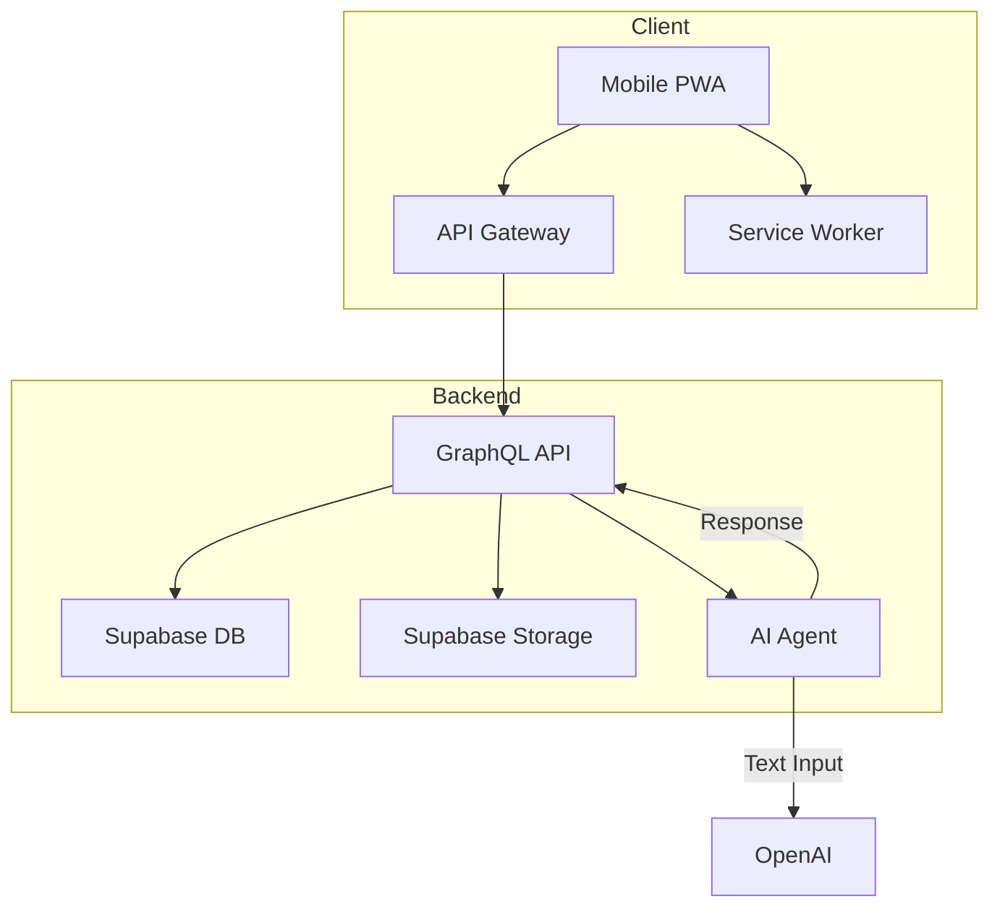

# 🏗 JobSight Platform Architecture

This document outlines the architecture behind JobSight’s full-stack platform — optimized for mobile-first field usage, AI-enhanced workflows, and scalable cloud-native deployment.

---

## 🧠 Architectural Principles

- **Mobile-first + Offline-first**: Priority on real-world field usage
- **AI-native**: Embedded AI assistant from day one
- **Composable micro-packages**: Easily extendable modules
- **Secure by default**: RBAC, CSP, TLS everywhere
- **DevOps-ready**: CI/CD, IaC, multi-env deployments

---

## 🧱 Core Stack Overview

| Layer         | Tech                         |
|---------------|------------------------------|
| Frontend      | Next.js 15 (App Router), TailwindCSS v4.1, DaisyUI v5.0 |
| Mobile App    | PWA with service worker + IndexedDB offline sync |
| Backend API   | Node.js (Express or Fastify), GraphQL |
| AI Layer      | OpenAI API / LangChain for voice logs + NL queries |
| Database      | Supabase (PostgreSQL, RLS) |
| Media Storage | Supabase Storage or Cloudinary |
| Auth & RBAC   | Clerk.dev (OAuth + RBAC integration) |
| CI/CD         | GitHub Actions → ACR → AKS (or Fly.io for MVP) |
| Infrastructure| AKS w/ Helm, cert-manager, nginx ingress |
| Monitoring    | Sentry, Logtail, Uptime Robot |

> **Note**: We use TailwindCSS v4.1 and DaisyUI v5.0. These versions support `tailwind.config.ts` natively and reflect current best practices in style config and design system integration.

---

## 🔁 Data Flow Diagram

---

## 📂 Key Modules

| Module          | Responsibilities |
|------------------|------------------|
| **Projects**     | Tasks, logs, budget, crew |
| **Logs**         | Text, photo, voice → text |
| **AI Assistant** | Summaries, queries, predictions |
| **Auth**         | Clerk sessions + role-based permissions |
| **Invoicing**    | Time + materials tracking, PDF export |
| **Notifications**| Real-time crew updates, webhook-ready |

---

## 🔒 Security Model

- **Row-Level Security (RLS)** for tenant isolation
- **Role-based access**: admin vs field worker
- **HTTPS enforced** (via cert-manager + ingress)
- **JWT/session tokens** via Clerk
- **CSP & XSS headers** in Next.js

---

## ☁️ Deployment Pipeline

| Step                         | Tool |
|------------------------------|------|
| Code push                    | GitHub |
| Lint/Test                    | GitHub Actions |
| Container build & push       | Docker + ACR |
| Infra deployment             | Helm + Terraform (AKS / Fly.io) |
| Certs & DNS                  | cert-manager + ExternalDNS |
| Rollbacks & Observability    | Sentry + Logs + Dashboards |

---

## 🛡 Compliance & Resilience

- ✅ Daily encrypted DB backups via Supabase or AKS volumes
- ✅ Separate staging/prod environments
- ✅ Downtime alerts via UptimeRobot + status page
- 🔜 DR runbook for region failover

---

## 🚀 Planned Upgrades

| Feature                          | Priority |
|----------------------------------|----------|
| Event-driven logs (Supabase Realtime or Kafka) | 🔜 |
| Multi-tenant environment switcher | 🔜 |
| Audit logging for compliance     | 🔜 |
| Custom field builders per module | 🔜 |
| Plugin architecture (Node)       | 🔜 |

---

## 🧩 Open Questions

- Use tRPC or GraphQL long-term?
- Clerk vs Firebase for long-term auth scaling?
- HLS video for walkthroughs?

