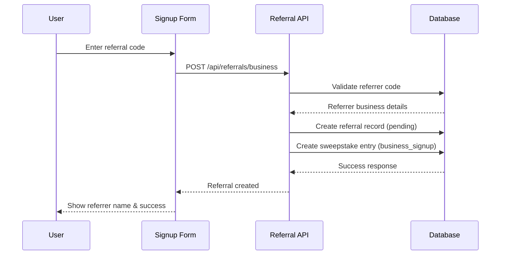
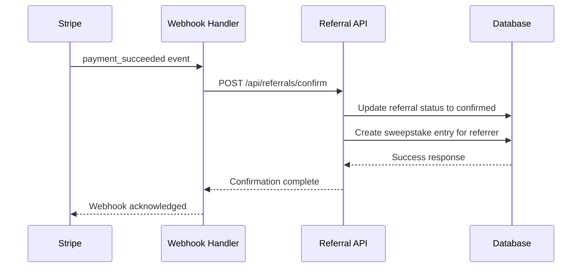
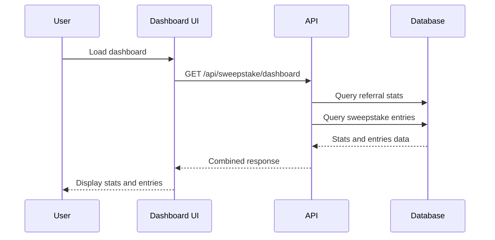

# JobSight Referral System Implementation Guide

## Overview

This document provides comprehensive guidance for implementing a business-to-business referral system for JobSight's sweepstake launch campaign. The system will track referrals between businesses (not individual users) and award sweepstake entries for valid plan subscriptions.

## Table of Contents

1. [Architecture Overview](#architecture-overview)
2. [Database Schema](#database-schema)
3. [Type Definitions](#type-definitions)
4. [API Endpoints](#api-endpoints)
5. [Component Architecture](#component-architecture)
6. [Integration Points](#integration-points)
7. [Data Flow](#data-flow)
8. [Security Considerations](#security-considerations)
9. [Testing Strategy](#testing-strategy)
10. [Performance Considerations](#performance-considerations)
11. [Deployment Checklist](#deployment-checklist)
12. [Monitoring & Analytics](#monitoring--analytics)

## Architecture Overview

### Core Components

The referral system consists of four main components:

1. **Database Layer**: New tables for referrals and sweepstake entries
2. **API Layer**: RESTful endpoints for referral management
3. **UI Layer**: React components for user interaction
4. **Integration Layer**: Hooks into existing business signup and subscription flows

### Key Design Decisions

- **Business-to-Business Model**: Referrals are between businesses, not individual users
- **Plan Validation**: Only Starter, Pro, and Business plans are eligible for referrals
- **Two-Phase Process**: Referrals created as "pending" and confirmed upon successful subscription
- **Unique Referral Codes**: Each business gets a unique shareable referral code
- **Sweepstake Integration**: Automatic entry creation for valid referrals

## Database Schema

### New Tables

#### 1. referrals

```sql
CREATE TABLE referrals (
    id UUID PRIMARY KEY DEFAULT gen_random_uuid(),
    referrer_business_id UUID NOT NULL REFERENCES businesses(id),
    referee_business_id UUID NOT NULL REFERENCES businesses(id),
    referee_user_id UUID NOT NULL REFERENCES auth.users(id),
    plan_type VARCHAR(50) NOT NULL CHECK (plan_type IN ('starter', 'pro', 'business')),
    subscription_id UUID REFERENCES business_subscriptions(id),
    status VARCHAR(20) DEFAULT 'pending' CHECK (status IN ('pending', 'confirmed', 'cancelled')),
    created_at TIMESTAMP WITH TIME ZONE DEFAULT NOW(),
    confirmed_at TIMESTAMP WITH TIME ZONE,
    UNIQUE(referrer_business_id, referee_business_id)
);
```

**Purpose**: Tracks referral relationships between businesses
**Key Fields**:
- `referrer_business_id`: Business that provided the referral
- `referee_business_id`: Business that was referred
- `plan_type`: Must be starter, pro, or business
- `status`: Tracks referral lifecycle (pending → confirmed/cancelled)

#### 2. sweepstake_entries

```sql
CREATE TABLE sweepstake_entries (
    id UUID PRIMARY KEY DEFAULT gen_random_uuid(),
    business_id UUID NOT NULL REFERENCES businesses(id),
    user_id UUID NOT NULL REFERENCES auth.users(id),
    entry_type VARCHAR(50) NOT NULL CHECK (entry_type IN ('business_signup', 'referral', 'bonus')),
    referral_id UUID REFERENCES referrals(id),
    plan_type VARCHAR(50),
    created_at TIMESTAMP WITH TIME ZONE DEFAULT NOW()
);
```

**Purpose**: Tracks sweepstake entries earned by businesses
**Key Fields**:
- `business_id`: Business that earned the entry
- `user_id`: User who earned the entry for the business
- `entry_type`: Type of entry (signup, referral, bonus)
- `referral_id`: Links to referral record if applicable

### Existing Table Modifications

#### businesses table

```sql
ALTER TABLE businesses ADD COLUMN referral_code VARCHAR(20) UNIQUE;
```

**Purpose**: Stores unique referral code for each business

### Indexes

```sql
CREATE INDEX idx_referrals_referrer_business ON referrals(referrer_business_id);
CREATE INDEX idx_referrals_referee_business ON referrals(referee_business_id);
CREATE INDEX idx_referrals_status ON referrals(status);
CREATE INDEX idx_sweepstake_entries_business ON sweepstake_entries(business_id);
CREATE INDEX idx_businesses_referral_code ON businesses(referral_code);
```

## Type Definitions

### Update src/types/supabase.ts

```typescript
export interface Database {
  public: {
    Tables: {
      // ... existing tables ...
      
      referrals: {
        Row: {
          id: string
          referrer_business_id: string
          referee_business_id: string
          referee_user_id: string
          plan_type: 'standard' | 'pro' | 'business'
          subscription_id: string | null
          status: 'pending' | 'confirmed' | 'cancelled'
          created_at: string
          confirmed_at: string | null
        }
        Insert: {
          id?: string
          referrer_business_id: string
          referee_business_id: string
          referee_user_id: string
          plan_type: 'standard' | 'pro' | 'business'
          subscription_id?: string | null
          status?: 'pending' | 'confirmed' | 'cancelled'
          created_at?: string
          confirmed_at?: string | null
        }
        Update: {
          id?: string
          referrer_business_id?: string
          referee_business_id?: string
          referee_user_id?: string
          plan_type?: 'standard' | 'pro' | 'business'
          subscription_id?: string | null
          status?: 'pending' | 'confirmed' | 'cancelled'
          created_at?: string
          confirmed_at?: string | null
        }
      }

      sweepstake_entries: {
        Row: {
          id: string
          business_id: string
          user_id: string
          entry_type: 'business_signup' | 'referral' | 'bonus'
          referral_id: string | null
          plan_type: string | null
          created_at: string
        }
        Insert: {
          id?: string
          business_id: string
          user_id: string
          entry_type: 'business_signup' | 'referral' | 'bonus'
          referral_id?: string | null
          plan_type?: string | null
          created_at?: string
        }
        Update: {
          id?: string
          business_id?: string
          user_id?: string
          entry_type?: 'business_signup' | 'referral' | 'bonus'
          referral_id?: string | null
          plan_type?: string | null
          created_at?: string
        }
      }

      businesses: {
        Row: {
          // ... existing fields ...
          referral_code: string | null
        }
        Insert: {
          // ... existing fields ...
          referral_code?: string | null
        }
        Update: {
          // ... existing fields ...
          referral_code?: string | null
        }
      }
    }
  }
}
```

### New Type Definitions

```typescript
// src/types/referral.ts
export interface Referral {
  id: string
  referrer_business_id: string
  referee_business_id: string
  referee_user_id: string
  plan_type: 'standard' | 'pro' | 'business'
  subscription_id: string | null
  status: 'pending' | 'confirmed' | 'cancelled'
  created_at: string
  confirmed_at: string | null
}

export interface SweepstakeEntry {
  id: string
  business_id: string
  user_id: string
  entry_type: 'business_signup' | 'referral' | 'bonus'
  referral_id: string | null
  plan_type: string | null
  created_at: string
}

export interface ReferralStats {
  totalEntries: number
  businessSignups: number
  confirmedReferrals: number
  pendingReferrals: number
  referralCode: string
  businessName: string
}
```

## API Endpoints

### File Structure

```
src/app/api/
├── referrals/
│   ├── business/
│   │   └── route.ts           # Create business referral
│   ├── confirm/
│   │   └── route.ts           # Confirm referral after subscription
│   └── stats/
│       └── route.ts           # Get referral statistics
├── businesses/
│   └── [id]/
│       └── referral-code/
│           └── route.ts       # Generate/get referral code
└── sweepstake/
    ├── entries/
    │   └── route.ts           # Get sweepstake entries
    └── dashboard/
        └── route.ts           # Get dashboard stats
```

### Endpoint Specifications

#### POST /api/referrals/business

**Purpose**: Create a new business referral
**Authentication**: Required
**Request Body**:
```typescript
{
  referrer_code: string,
  business_id: string,
  plan_type: 'standard' | 'pro' | 'business'
}
```

**Response**:
```typescript
{
  success: boolean,
  referral?: Referral,
  referrer_business?: string,
  error?: string
}
```

**Validation**:
- User must be authenticated
- Referrer code must exist
- Plan type must be valid
- Cannot refer own business
- No duplicate referrals

#### POST /api/referrals/confirm

**Purpose**: Confirm referral after successful subscription
**Authentication**: Required (webhook or internal)
**Request Body**:
```typescript
{
  referral_id: string,
  subscription_id: string
}
```

**Response**:
```typescript
{
  success: boolean,
  error?: string
}
```

**Actions**:
- Updates referral status to 'confirmed'
- Awards sweepstake entry to referrer business
- Links subscription to referral

#### POST /api/businesses/[id]/referral-code

**Purpose**: Generate or retrieve business referral code
**Authentication**: Required (business owner/admin)
**Response**:
```typescript
{
  referral_code: string
}
```

**Logic**:
- Generates unique code if none exists
- Returns existing code if already generated
- Code format: Business prefix + random suffix

#### GET /api/sweepstake/dashboard

**Purpose**: Get sweepstake dashboard statistics
**Authentication**: Required
**Query Parameters**:
- `business_id`: Required business ID

**Response**:
```typescript
{
  stats: ReferralStats,
  entries: SweepstakeEntry[]
}
```

## Component Architecture

### Component Hierarchy

```
src/components/referral/
├── BusinessReferralInput.tsx     # Referral code input during signup
├── BusinessSweepstakeDashboard.tsx # Main dashboard component
├── ReferralCodeGenerator.tsx     # Generate/display referral codes
├── ReferralStats.tsx            # Statistics display
├── SweepstakeEntryList.tsx      # List of entries
└── ReferralShareModal.tsx       # Share referral code modal
```

### Key Components

#### BusinessReferralInput

**Purpose**: Input component for entering referral codes during business signup
**Props**:
```typescript
interface BusinessReferralInputProps {
  businessId: string
  planType: 'standard' | 'pro' | 'business'
  onReferralSubmit: (code: string, referrerName: string) => Promise<void>
}
```

**Features**:
- Real-time validation
- Error handling
- Success feedback
- Plan type validation

#### BusinessSweepstakeDashboard

**Purpose**: Main dashboard showing referral statistics and entries
**Props**:
```typescript
interface BusinessSweepstakeDashboardProps {
  businessId: string
}
```

**Features**:
- Statistics overview
- Entry listing
- Referral code management
- Real-time updates

#### ReferralCodeGenerator

**Purpose**: Generate and display business referral codes
**Props**:
```typescript
interface ReferralCodeGeneratorProps {
  businessId: string
  onCodeGenerated: (code: string) => void
}
```

**Features**:
- Code generation
- Copy to clipboard
- Share functionality
- Regeneration (if needed)

## Integration Points

### 1. Business Signup Flow

**File**: `src/app/(public)/(auth)/sign-up/[[...rest]]/page.tsx`

**Integration Point**: After business information step, before plan selection

**Implementation**:
```typescript
// Add to existing state
const [referralCode, setReferralCode] = useState<string>('')
const [referralApplied, setReferralApplied] = useState(false)

// Add referral step between business and plans
const handleReferralSubmit = async (code: string, referrerName: string) => {
  setReferralCode(code)
  setReferralApplied(true)
  // Show success message with referrer name
}

// Modify business form submission to include referral
const handleBusinessFormSubmit = async (e: React.FormEvent) => {
  // ... existing code ...
  
  // Include referral information
  const businessData = {
    ...businessForm,
    referralCode: referralApplied ? referralCode : null
  }
  
  // ... rest of submission logic ...
}
```

**UI Flow**:
1. User completes business information
2. Referral input component appears
3. User can optionally enter referral code
4. System validates and shows referrer name
5. User proceeds to plan selection
6. Referral is created during business creation

### 2. Subscription Confirmation

**File**: `src/app/api/webhooks/stripe/route.ts`

**Integration Point**: Stripe webhook handler for successful payments

**Implementation**:
```typescript
export async function POST(request: NextRequest) {
  // ... existing webhook code ...
  
  if (event.type === 'invoice.payment_succeeded') {
    const subscription = event.data.object
    
    // Get business ID from subscription metadata
    const businessId = subscription.metadata?.business_id
    
    if (businessId) {
      // Confirm any pending referrals for this business
      await confirmPendingReferrals(businessId, subscription.id)
    }
  }
  
  return NextResponse.json({ received: true })
}

async function confirmPendingReferrals(businessId: string, subscriptionId: string) {
  const supabase = createClient()
  
  // Find pending referrals for this business
  const { data: pendingReferrals } = await supabase
    .from('referrals')
    .select('id')
    .eq('referee_business_id', businessId)
    .eq('status', 'pending')
  
  // Confirm each referral
  for (const referral of pendingReferrals || []) {
    await fetch(`${process.env.NEXT_PUBLIC_APP_URL}/api/referrals/confirm`, {
      method: 'POST',
      headers: { 'Content-Type': 'application/json' },
      body: JSON.stringify({
        referral_id: referral.id,
        subscription_id: subscriptionId
      })
    })
  }
}
```

### 3. Business Dashboard

**File**: `src/app/dashboard/page.tsx`

**Integration Point**: Main dashboard widget area

**Implementation**:
```typescript
// Add to existing dashboard components
import { BusinessSweepstakeDashboard } from '@/components/referral/BusinessSweepstakeDashboard'

export default function DashboardPage() {
  const { businessId } = useBusiness()
  
  return (
    <div className="space-y-6">
      {/* ... existing dashboard components ... */}
      
      {/* Sweepstake Dashboard Widget */}
      <div className="card bg-base-100 shadow-lg">
        <div className="card-header">
          <h2 className="card-title">Sweepstake Campaign</h2>
        </div>
        <div className="card-body">
          <BusinessSweepstakeDashboard businessId={businessId} />
        </div>
      </div>
    </div>
  )
}
```

### 4. Business Settings

**File**: `src/app/dashboard/settings/page.tsx`

**Integration Point**: Business settings page for referral code management

**Implementation**:
```typescript
// Add referral code section to business settings
import { ReferralCodeGenerator } from '@/components/referral/ReferralCodeGenerator'

export default function SettingsPage() {
  return (
    <div className="space-y-6">
      {/* ... existing settings sections ... */}
      
      {/* Referral Code Section */}
      <div className="card bg-base-100 shadow-lg">
        <div className="card-header">
          <h3 className="card-title">Referral Program</h3>
        </div>
        <div className="card-body">
          <p className="text-sm text-gray-600 mb-4">
            Share your referral code with other businesses to earn sweepstake entries
          </p>
          <ReferralCodeGenerator businessId={businessId} />
        </div>
      </div>
    </div>
  )
}
```

## Data Flow

### Referral Creation Flow



### Referral Confirmation Flow



### Dashboard Data Flow



## Security Considerations

### Authentication & Authorization

1. **Referral Creation**: Only authenticated users can create referrals
2. **Referral Code Generation**: Only business owners/admins can generate codes
3. **Dashboard Access**: Only business members can view dashboard
4. **Webhook Security**: Stripe signature verification required

### Data Validation

1. **Plan Type Validation**: Only eligible plans accepted
2. **Business Ownership**: Verify user has access to business
3. **Unique Constraints**: Prevent duplicate referrals
4. **Status Validation**: Proper state transitions only

### Rate Limiting

1. **Referral Creation**: Limit attempts per user per time period
2. **Code Generation**: Prevent abuse of code generation
3. **Dashboard Queries**: Reasonable refresh limits

### Input Sanitization

1. **Referral Codes**: Alphanumeric validation
2. **Business IDs**: UUID validation
3. **Plan Types**: Enum validation

## Testing Strategy

### Unit Tests

```typescript
// src/tests/referral.test.ts
describe('Referral System', () => {
  describe('Referral Creation', () => {
    it('should create referral for valid business code', async () => {
      // Test valid referral creation
    })
    
    it('should reject invalid plan types', async () => {
      // Test plan type validation
    })
    
    it('should prevent self-referrals', async () => {
      // Test business cannot refer itself
    })
    
    it('should prevent duplicate referrals', async () => {
      // Test unique constraint
    })
  })
  
  describe('Referral Confirmation', () => {
    it('should confirm referral and award entries', async () => {
      // Test confirmation flow
    })
    
    it('should handle missing referrals gracefully', async () => {
      // Test error handling
    })
  })
  
  describe('Dashboard Statistics', () => {
    it('should calculate correct statistics', async () => {
      // Test stats calculation
    })
  })
})
```

### Integration Tests

```typescript
// src/tests/integration/referral-flow.test.ts
describe('Referral Flow Integration', () => {
  it('should complete full referral flow', async () => {
    // Test end-to-end referral process
    // 1. Create referrer business with code
    // 2. Create referee business with referral
    // 3. Complete subscription
    // 4. Verify entries awarded
  })
  
  it('should handle webhook confirmation', async () => {
    // Test Stripe webhook integration
  })
})
```

### Component Tests

```typescript
// src/tests/components/BusinessReferralInput.test.tsx
describe('BusinessReferralInput', () => {
  it('should validate referral codes', async () => {
    // Test input validation
  })
  
  it('should show error for invalid codes', async () => {
    // Test error handling
  })
  
  it('should display referrer name on success', async () => {
    // Test success state
  })
})
```

## Performance Considerations

### Database Optimization

1. **Indexes**: On frequently queried fields
2. **Query Optimization**: Efficient joins and filters
3. **Connection Pooling**: Supabase connection management

### Caching Strategy

1. **Referral Code Cache**: Cache business referral codes
2. **Dashboard Stats Cache**: Cache calculated statistics
3. **Plan Validation Cache**: Cache eligible plan types

### Component Optimization

1. **Lazy Loading**: Dynamic imports for modal components
2. **Memoization**: React.memo for expensive components
3. **Debouncing**: Search and filter inputs

## Deployment Checklist

### Pre-Deployment

- [ ] Database migrations applied
- [ ] Type definitions updated
- [ ] API endpoints implemented
- [ ] Components developed
- [ ] Integration points updated
- [ ] Tests written and passing
- [ ] Security review completed

### Database Changes

- [ ] Run migration scripts in staging
- [ ] Verify table creation and constraints
- [ ] Test indexes and performance
- [ ] Seed test data
- [ ] Backup production database

### API Deployment

- [ ] Deploy API endpoints
- [ ] Test authentication
- [ ] Verify webhook integration
- [ ] Test error handling
- [ ] Monitor API performance

### UI Components

- [ ] Test component rendering
- [ ] Verify form validation
- [ ] Test responsive design
- [ ] Verify accessibility compliance
- [ ] Test cross-browser compatibility

### Integration Testing

- [ ] Test complete signup flow
- [ ] Verify subscription confirmation
- [ ] Test dashboard functionality
- [ ] Verify error scenarios
- [ ] Test webhook reliability

### Post-Deployment

- [ ] Monitor error rates
- [ ] Check performance metrics
- [ ] Verify data integrity
- [ ] Test user workflows
- [ ] Monitor webhook delivery

## Monitoring & Analytics

### Key Metrics

1. **Referral Conversion Rate**: Pending to confirmed referrals
2. **Plan Distribution**: Which plans are referred most
3. **Top Referrers**: Most active referring businesses
4. **Sweepstake Participation**: Total entries and distribution
5. **Signup Conversion**: Impact on business signups

### Error Monitoring

1. **API Errors**: Failed referral creation/confirmation
2. **Database Errors**: Constraint violations
3. **Webhook Failures**: Stripe integration issues
4. **UI Errors**: Component rendering failures

### Performance Monitoring

1. **API Response Times**: Referral endpoints
2. **Database Query Performance**: Complex joins
3. **Component Render Times**: Dashboard components
4. **Webhook Processing Time**: Confirmation flow

### Business Intelligence

1. **Referral Network Analysis**: Business relationship mapping
2. **Campaign Effectiveness**: Signup attribution
3. **User Behavior**: Referral code usage patterns
4. **Revenue Impact**: Referral-driven subscriptions

## Implementation Timeline

### Phase 1: Foundation (Week 1)
- Database schema and migrations
- Type definitions
- Basic API endpoints
- Unit tests

### Phase 2: Core Features (Week 2)
- Referral creation and validation
- Webhook integration
- Dashboard components
- Integration tests

### Phase 3: UI Integration (Week 3)
- Signup flow integration
- Dashboard widgets
- Settings page updates
- Component tests

### Phase 4: Testing & Deployment (Week 4)
- End-to-end testing
- Performance optimization
- Security review
- Production deployment

### Phase 5: Monitoring & Optimization (Week 5)
- Analytics setup
- Performance monitoring
- Bug fixes and optimizations
- Documentation updates

## Conclusion

This comprehensive guide ensures the referral system integrates seamlessly with JobSight's existing architecture while maintaining high code quality and system reliability. The phased approach allows for careful testing and validation at each step, minimizing risks during deployment.

The system provides a solid foundation for the sweepstake campaign while being extensible for future referral program enhancements.