### 📄 `UX-FLOW.md`

# 🧭 JobSight UX Flow (MVP)

This document outlines the primary user experience flows for JobSight's MVP. It focuses on essential navigation, jobsite workflows, and responsive usability for foremen, project managers, and field staff.

---

## 🏁 First-Time User Flow

```mermaid
graph TD
  A[Landing Page] --> B[Sign Up / Sign In (Clerk)]
  B --> C[Create Organization or Join]
  C --> D[Create First Project]
  D --> E[Add Tasks / Invite Team]
  E --> F[Submit First Log or AI Voice Note]
  F --> G[Dashboard View]
```

---

## 🔁 Daily Workflow (Field Crew)

```mermaid
graph TD
  A[Login (PWA)] --> B[View Assigned Projects]
  B --> C[Open Daily Log Tab]
  C --> D{Add Entry Type}
  D -->|Text Form| E1[Fill + Submit Log]
  D -->|Voice Note| E2[Record → AI Transcribe → Review]
  E1 --> F[Upload Photos (optional)]
  E2 --> F
  F --> G[Save Log → Sync Queue if Offline]
```

---

## 📋 Task Management Flow (Manager)

```mermaid
graph TD
  A[Dashboard → Projects] --> B[Select Project]
  B --> C[View Tasks Tab]
  C --> D[Add/Edit Tasks]
  D --> E[Assign User / Set Due Date]
  E --> F[Drag to Reorder / Mark Critical]
```



---

## 📦 Invoicing Flow (Owner/Admin)


---

## 🧠 AI Assistant Flow

```mermaid
graph TD
  A[Project View] --> B[Click Ask AI]
  B --> C[Enter Question (text)]
  C --> D[LangChain + OpenAI Query]
  D --> E[Return Response + Linked Entries]
  E --> F[Optional: Save as Note or Summary]
```

---

## 📲 Mobile UX Considerations

- PWA install prompt appears on mobile
- Sticky bottom nav: Projects · Logs · AI · Profile
- Offline mode indicator (yellow bar + queued count)
- Auto-save on navigation away from log form
- File uploads queued w/ preview thumbnails
- Large tap targets, low-distraction mode on forms

---

## 🔐 Access Control UX

| Role   | Tabs Visible                | Write Access To               |
|--------|-----------------------------|-------------------------------|
| Admin  | All                         | All projects, invoices, users |
| Manager| Projects, Logs, Tasks, AI   | Assigned projects only        |
| Worker | Logs, Tasks, AI             | Own logs/tasks only           |

---

This UX flow will evolve as we introduce more advanced modules (e.g. permit tracking, shift check-ins, custom dashboards).
